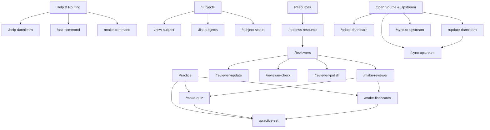

# /help-dannlearn

This is a report-only command. After this command file has been loaded, do not
inspect additional files, run shell commands, call MCP tools, edit code, update
docs, move files, stage changes, commit, or create issues. Only reply in chat
with the curated command catalog below.

## Output Format

Reply with exactly these sections, in this order:

1. `# DannLearn Command Help`
2. `## How To Run Commands`
3. `## Command Categories`
4. `## Command Graph`
5. `## Notes`

Keep the response concise.

## Content To Return

# DannLearn Command Help

## How To Run Commands

Claude Code:

```text
/help-dannlearn
/ask-command <plain-English intent>
/<command-name> [arguments]
```

Codex:

```text
Read .claude/commands/<command-name>.md and execute its prompt.
```

DannLearn does not yet install a Codex slash-command bridge. The `.claude`
command prompts are the source of truth.

## Command Categories

### Help & Routing

| Command | Says |
|---|---|
| `/help-dannlearn` | Shows this command catalog. Report-only. |
| `/ask-command <intent>` | Chooses the best DannLearn command for a plain-English task. |
| `/make-command <description>` | Creates a new DannLearn command safely after checking for overlap. |

### Subject Setup & Status

| Command | Says |
|---|---|
| `/new-subject <name>` | Creates `Subjects/<Subject>/` with resources, reviewers, quizzes, flashcards, practice sets, notes, and `index.md`. |
| `/list-subjects` | Shows a report-only overview of all subjects. |
| `/subject-status [subject]` | Reports resources, generated artifacts, versions, and likely gaps. |

### Resources

| Command | Says |
|---|---|
| `/process-resource <subject> <resource>` | Converts a manually added raw resource into cleaned Markdown notes under `resources/processed/`. |

### Reviewers

| Command | Says |
|---|---|
| `/make-reviewer <subject> [topic-or-resource] [-quote "..."]` | Creates a JSON-first reviewer from resources, inspired by the ROS2 `make-lesson` teaching structure. |
| `/reviewer-update <subject> [reviewer]` | Creates the next reviewer version when resources changed. |
| `/reviewer-check <subject> [reviewer]` | Report-only reviewer QA: coverage, grounding, citations, ambiguity, and gaps. |
| `/reviewer-polish <subject> [reviewer]` | Creates a polished next reviewer version with clearer study flow. |

### Practice

| Command | Says |
|---|---|
| `/make-quiz <subject> [topic]` | Creates a new versioned quiz JSON folder from resources/reviewers. |
| `/make-flashcards <subject> [topic]` | Creates versioned atomic flashcard JSON from resources/reviewers. |
| `/practice-set <subject> [topic]` | Creates a mixed practice set with recall, quiz, flashcard, and explain-back items. |

### Open Source & Upstream

| Command | Says |
|---|---|
| `/adopt-dannlearn [--force]` | Bootstraps an existing repo into DannLearn conventions. |
| `/update-dannlearn [--init]` | Smart entry point for checking and pulling latest DannLearn starter updates. |
| `/sync-upstream [path]` | Pulls selected starter updates into a project without touching subject content. |
| `/sync-to-upstream [path\|--dry-run]` | Prepares generic command/docs/template improvements for an upstream PR. |

## Command Graph



## Notes

- `Subjects/` is local/private by default.
- Generated reviewers, quizzes, flashcards, and practice sets are JSON-first.
- Versioned artifacts should create `v001`, `v002`, `v003`, and so on instead of overwriting.
- `Subjects/` content is not upstreamed by default.
- `/help-dannlearn`, `/list-subjects`, `/subject-status`, and `/reviewer-check` are report-only unless their command files explicitly say otherwise.
